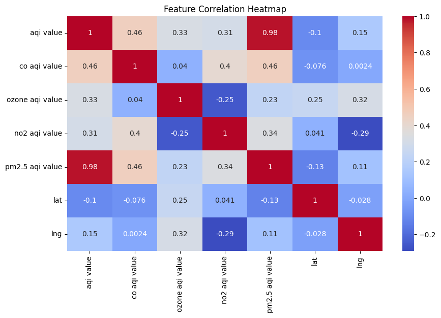
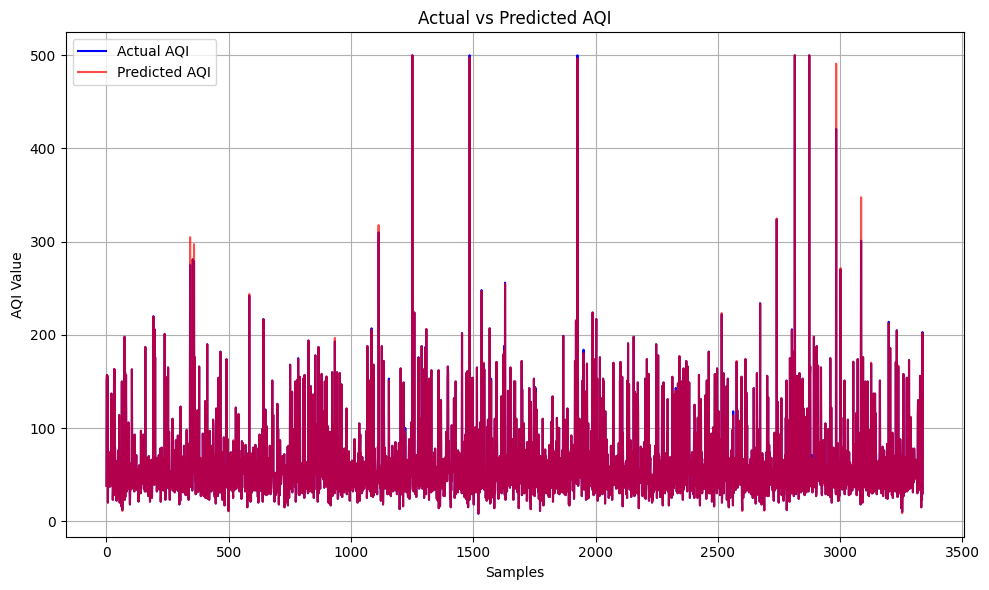

# 🌍 Predicting Air Quality Index using Machine Learning

## 📖 Project Overview

This project predicts the Air Quality Index (AQI) using Machine Learning based on pollutant concentrations such as PM2.5, PM10, NO₂, SO₂, CO, and O₃.

The model performs data preprocessing, exploratory data analysis (EDA), model training, evaluation, and visualization.


## ✨ Features

- Data Cleaning & Preprocessing
- Exploratory Data Analysis (EDA)
- Correlation Heatmap
- Random Forest Regression Model
- Performance Evaluation
- Actual vs Predicted AQI Visualization


## 🛠️ Technologies Used

- Python
- Pandas
- NumPy
- Matplotlib
- Seaborn
- Scikit-learn


## 📂 Dataset

`air_quality_data.csv`


## 📸 Project Screenshots

### Correlation Heatmap



### Actual vs Predicted AQI




## How to Run

```bash
pip install -r requirements.txt
python air_quality_prediction.py


## 👨‍💻 Author
Ayush Yadav
B.Tech Electrical Engineering
Delhi Technological University (DTU)
